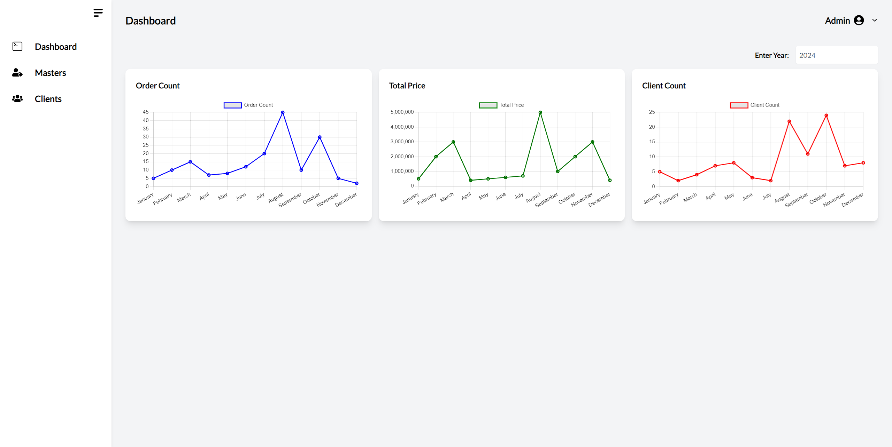

<div align="center">
<!-- <h1 align="center">Football Stadium Dashboard</h1> -->


<h1>Football Stadium Dashboard</h1>

</div>

## 
##
#### This project is a **Football Stadium Dashboard** designed to manage and display various information about football stadiums, including event schedules and more. The dashboard offers an interactive interface for users to navigate easily and get the information they need.

## Features

- **Responsive Design**: Fully responsive for use on both desktop and mobile devices.

## Technologies Used

- **Frontend**: React.js, Tailwind CSS
- **UI**: Flowbite, Shadcn
- **Charts and Graphs**: Chart.js for displaying various data visualizations.

## Developers

|  №  |      Name     |     Component     |
|-----|---------------|-------------------|
|  1  |   Jasur       ||
|  2  |   Javlon      ||
|  3  |   Shohjahon   ||

## Demo View

1. Routes (Pages)
    <select>
        <option>
            Routes
        </option>
        <option>
            /dashboard
        </option>
    </select>

 1. Dashboard

    


## Installation

1. Clone the repository:

   ```bash
   git clone https://github.com/jasurhaydarovcode/football-stadium-dashboard.git
   ```

2. Navigate to the project directory:

    ```bash
    cd football-stadium-dashboard
    ```

3. Install the required dependencies:

    ```bash
    npm install
    ```

4. Run the project:
    ```bash
    npm run dev
    ```